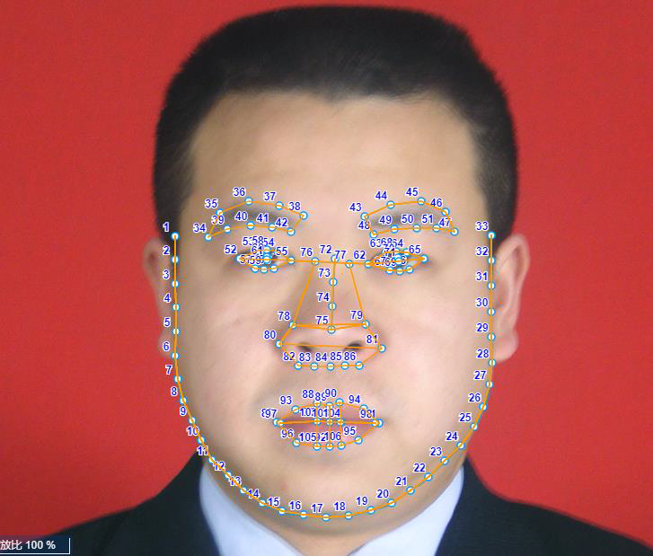
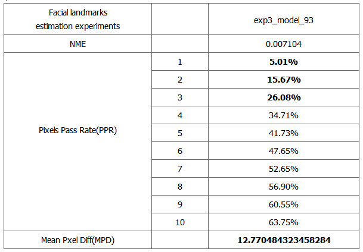
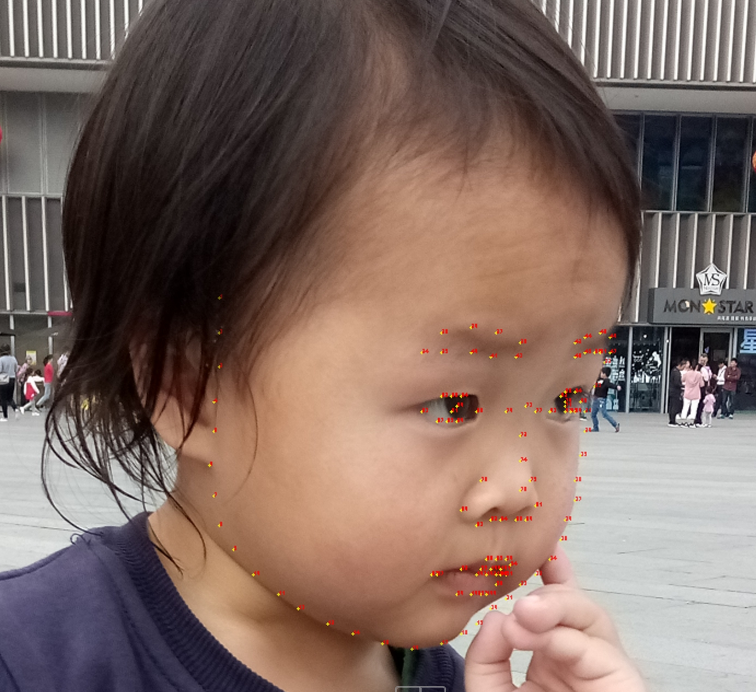
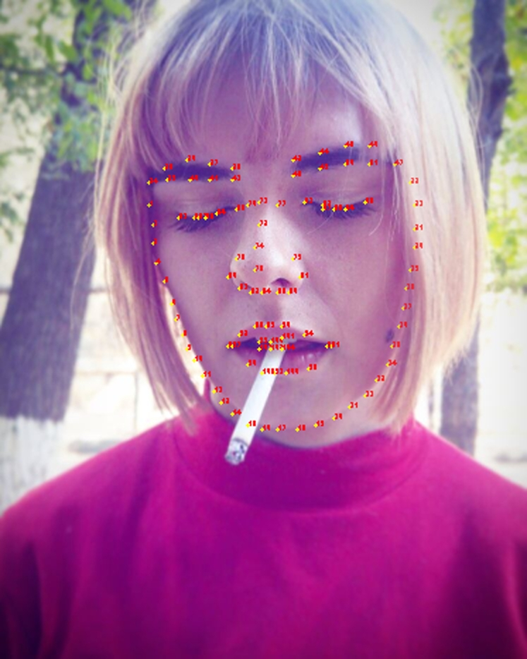

# DT_Facial_106_Landmarks

DT_Facial_106_Landmarks实现对多种极具挑战的场景中人脸106关键点的检测，包括多姿态、多人种、复杂表情(侧脸、有色眼镜、轻微遮挡、瞪眼、嘟嘴、抿嘴)等多种类型场景。该代码仓库Fork自Alphapose官方代码仓库，训练数据为**数据堂(Datatang)人脸106关键点数据集**。在高质量大规模的数据驱动下，实现对人脸106关键点的有效精准检测。


# 人脸106关键点定义

<p align="center">
    
</p>


# 性能指标

Pixels Pass Rate(PPR)：指预测点与真值点间距离小于N(N=1, 2, 3, ...)像素的关键点的百分比。

Mean Pxel Diff(MPD)：贴合度指标，所有关键点预测值与真值间距离的加权平均值。

exp3_model_93：在**数据堂(Datatang)人脸106关键点数据集**上，训练第三阶段迭代93次所得模型。

<p align="center">
    
</p>

注：上述指标均在数据堂(Datatang)人脸106关键点数据集测试集(11266张)上进行评测。

<p align="center">
    
    
    
    
</p>
<p align="center">
    
    
    
    
</p>


# 安装

## 环境

此代码是使用带有NVIDIA GPU的Ubuntu 16.04上的Python 3.5和pytorch 0.4.0开发的。使用带有CUDA 9.0和cuDNN 7.0的1个NVIDIA GTX 1080TI GPU进行训练和测试，其他平台或GPU未经过全面测试。

## 依赖项

1. 请按照PyTorch官方说明安装pytorch 0.4.0

2. 安装依赖项

```
pip install -r requirements.txt
```

3. 克隆项目

```
git clone https://github.com/datatang-ailab/DT_Facial_106_Landmarks.git
```

4. Disable cudnn for batch_norm: (See: @Microsoft / human-pose-estimation.pytorch#installation)

```
# PYTORCH=/path/to/pytorch
# for pytorch v0.4.0
sed -i "1194s/torch\.backends\.cudnn\.enabled/False/g" ${PYTORCH}/torch/nn/functional.py
# for pytorch v0.4.1
sed -i "1254s/torch\.backends\.cudnn\.enabled/False/g" ${PYTORCH}/torch/nn/functional.py

# Note that instructions like # PYTORCH=/path/to/pytorch indicate that you should pick 
# a path where you'd like to have pytorch installed and then set an environment
# variable (PYTORCH in this case) accordingly.
```

## 预训练模型

请手动下载模型：duc_se.pth([Baidu pan](https://pan.baidu.com)), yolov3-spp.weights( [Baidu pan](https://pan.baidu.com/s/1Zb2REEIk8tcahDa8KacPNA))，将它们分别放入./models/sppe和./models/yolo。


# 运行

## 测试

```
python3 demo.py --indir ${img_directory} --outdir ${out_dir} --nClasses 106 --save_img
# example:
python3 demo.py --indir examples/imgs/ --outdir examples/outputs/ --nClasses 106 --save_img
```

## 训练

```
cd train_sppe/src

# Stage 1
python train.py --dataset dt_fac_106_ldmks --expID stg_1 --nClasses 106 --LR 1e-4 --trainBatch 32 --validBatch 32 --nEpochs 1000000 --nThreads 30 --inputResH 256 --inputResW 256 --outputResH 64 --outputResW 64 --optMethod adam

# Stage 2
python train.py --dataset dt_fac_106_ldmks --expID stg_2 --nClasses 106 --LR 1e-4 --trainBatch 32 --validBatch 32 --nEpochs 1000000 --nThreads 30 --inputResH 256 --inputResW 256 --outputResH 64 --outputResW 64 --optMethod adam --loadModel ../exp/coco/stg_1/model_30.pkl --addDPG

# Or, train with decayed learning rate for stage 2
python train.py --dataset dt_fac_106_ldmks --expID stg_2 --nClasses 106 --LR 1e-5 --trainBatch 32 --validBatch 32 --nEpochs 1000000 --nThreads 30 --inputResH 256 --inputResW 256 --outputResH 64 --outputResW 64 --optMethod adam --loadModel ../exp/coco/stg_1/model_30.pkl --addDPG

## Tensorboard
Stage 1: nohup tensorboard --logdir .tensorboard/coco/stg_1/ &
Stage 2: nohup tensorboard --logdir .tensorboard/coco/stg_2/ --port 6007 &

```


# Datatang数据集

## 数据集样例介绍

数据堂(Datatang)人脸106关键点数据集共112663张，每张图像中只有一个人脸，其中简单表情共62320张，复杂表情共50343张。

训练集(train)、验证集(val)、测试集(test)图像数量分别为: 90131张、11266张、11266张。

数据产品概述如下：

- 人员分布：黄种人、白种人、黑种人
- 年龄分布：婴儿、少年、青年、中年、老年
- 数据格式：jpg(彩色)
- 数据特点：涵盖多种场景、多种姿态、多种人种、复杂表情(侧脸、有色眼镜、轻微遮挡、瞪眼、嘟嘴、抿嘴)等
- 标注内容：人脸属性(性别、年龄、肤色、带帽状态、戴眼镜状态、背景状态等10种属性)标注，人脸关键点(106关键点)标注


## 更多数据资源

数据堂是一家专业的人工智能数据服务提供商，致力于为全球人工智能企业提供数据获取、处理及数据产品服务，覆盖语音、图像、文本等数据类型，涵盖生物识别、语音识别、自动驾驶、智能家居、智能制造、新零售、OCR场景、智能医疗、智能交通、智能安防、手机娱乐等领域。

- 获取更多开源数据集，请访问[这里](https://www.datatang.com/webfront/opensource.html)
- 了解更多商业数据集，请点击[这里](https://www.datatang.com/webfront/datatang_dataset.html)

面向高校及科研群体,数据堂将持续开源更多高质量商业数据集,帮助研究人员拓宽研究领域，丰富研究内容，加速迭代。敬请期待！